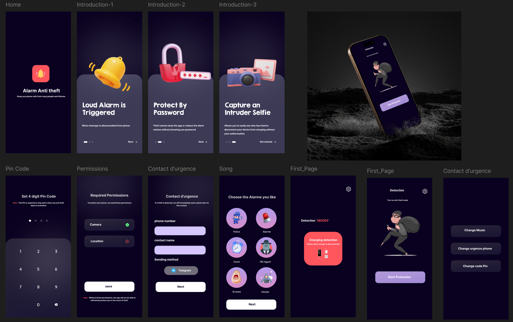
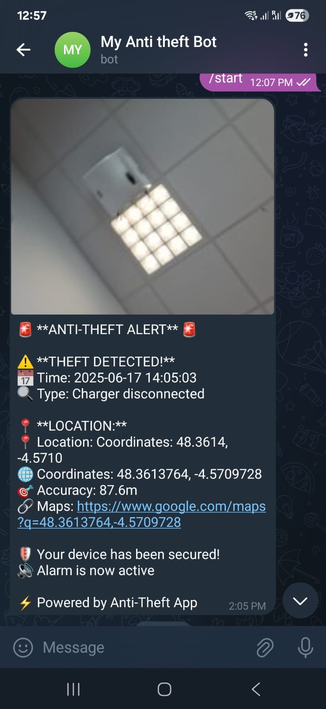

# 📱 Application Anti-vol 

🔒 **Marre de surveiller votre téléphone quand vous le chargez en public ?**  
Dans le train, à l'aéroport ou à l'hôtel, il suffit d'un instant pour qu'on vous le vole...

**Avec notre application anti-vol**, plus besoin de stresser !  
Dès que quelqu'un débranche votre téléphone sans votre autorisation, une **alarme forte** se déclenche immédiatement.

Et ce n'est pas tout :
- 📸 Une **photo** du voleur est prise avec la caméra frontale  
- 💬 Elle est envoyée à un **contact de confiance** par Telegram
- 🔐 L'alarme ne s'arrête que si vous entrez le **bon code PIN**  
- 🔒 Les boutons sont **verrouillés**, impossible de tricher !

**Simple, efficace, et rassurant.**  
Protégez votre téléphone, même quand vous ne pouvez pas le surveiller.

---

## 🎯 Fonctionnalités Implémentées

### 🔔 Système de Détection Multi-Modal
- **Détection de Débranchement du Chargeur** : Se déclenche automatiquement quand le chargeur est débranché
- **Détection de Mouvement** : Utilise l'accéléromètre pour détecter si l'appareil est bougé ou secoué
- **Protection contre l'Accès Non Autorisé** : Sécurise l'appareil contre toute utilisation non autorisée

### 🚨 Réponse de Sécurité
- **Système d'Alarme Sonore** : 6 sons d'alarme différents (Police, FBI, Hacker, etc.)
- **Capture de Selfie d'Intrus** : Prend automatiquement une photo avec la caméra frontale
- **Suivi de Localisation GPS** : Enregistre la position précise lors de la détection de vol
- **Alertes Telegram** : Envoie des notifications instantanées avec photo et localisation

### 🔐 Fonctionnalités de Protection
- **Sécurité par Code PIN** : Code PIN à 4 chiffres requis pour arrêter l'alarme
- **Wake Lock** : Maintient l'appareil actif pendant l'alarme
- **Services de Premier Plan** : Assure une protection continue
- **Verrouillage d'Application** : Empêche la fermeture non autorisée de l'application

## 🎨 Interface Utilisateur

L'application dispose d'une interface moderne avec un thème sombre, créée avec Figma et implémentée avec Jetpack Compose.

*Design d'interface moderne avec navigation intuitive et interface axée sur la sécurité*

## 📲 Intégration Telegram

Lorsqu'un vol est détecté, l'application envoie automatiquement une alerte complète à votre contact d'urgence via Telegram :

*Exemple d'alerte de vol reçue sur Telegram avec photo, localisation et détails de l'incident*

## 🏗️ Architecture

### Composants Principaux

#### 📊 Modèles de Données
- `AlarmSettings` : Configuration des préférences d'alarme
- `EmergencyContact` : Informations de contact Telegram
- `AppSettings` : Paramètres de l'application
- `TheftEvent` : Journalisation des incidents de vol

#### 🎯 Gestionnaires (Managers)
- **`AntiTheftManager`** : Gestion centrale de la sécurité
- **`CameraManager`** : Capture photo silencieuse avec l'API Camera2
- **`LocationManager`** : Services de localisation GPS
- **`TheftDetectionManager`** : Coordonne la réponse au vol

#### ⚙️ Services
- **`AlarmService`** : Alarme audio et vibration
- **`DetectionService`** : Surveillance des menaces en arrière-plan
- **`TelegramService`** : Livraison sécurisée des messages
- **`SafeCameraTelegramService`** : Capture et transmission coordonnées

#### 🖥️ Interface Utilisateur
- **Flux d'Intégration** : Écrans d'introduction avec explications des fonctionnalités
- **Assistant de Configuration** : PIN, permissions, contact d'urgence et sélection d'alarme
- **Écran de Détection** : Interface principale de contrôle de protection
- **Écran de Paramètres** : Gestion de la configuration
- **Saisie PIN** : Désactivation sécurisée de l'alarme

## 🛠️ Implémentation Technique

### 🔧 Technologies Clés
- **Kotlin** : Langage de développement principal
- **Jetpack Compose** : Framework d'interface utilisateur moderne
- **API Camera2** : Fonctionnalité avancée de caméra
- **SensorManager** : Détection de mouvement basée sur l'accéléromètre
- **SharedPreferences** : Persistance locale des données
- **Coroutines** : Opérations asynchrones
- **StateFlow** : Gestion d'état réactive

### 📡 Architecture des Services
- **Services de Premier Plan** : Assure un fonctionnement continu en arrière-plan
- **BroadcastReceivers** : Surveillance des événements système
- **WakeLocks** : Empêche la mise en veille de l'appareil pendant la protection active
- **NotificationManager** : Alertes utilisateur et statut des services

### 🔒 Mesures de Sécurité
- **Validation PIN** : Système de code sécurisé à 4 chiffres
- **Limitation des Tentatives** : Blocage temporaire après échecs
- **Persistance des Services** : Redémarrage automatique à la fin du service
- **Gestion des Permissions** : Gestion des permissions d'exécution

## 📋 Exigences de Configuration

### 🎯 Permissions Android
- `CAMERA` : Pour la capture photo d'intrus
- `ACCESS_FINE_LOCATION` : Pour le suivi GPS
- `VIBRATE` : Pour la vibration d'alarme
- `WAKE_LOCK` : Pour maintenir l'appareil actif
- `FOREGROUND_SERVICE` : Pour la protection en arrière-plan
- `INTERNET` : Pour les notifications Telegram

### 🤖 Configuration du Bot Telegram
L'application utilise un bot Telegram pré-configuré pour la livraison des messages :
- Token du Bot : `7850144991:AAEJN6LBJ3AS3_zEKCy3AFTF884exy9qZ8c`
- Les utilisateurs doivent obtenir leur Chat ID de `@userinfobot`

## 👥 Réalisé par
- **Ayoub Machkour**
- **Elham Amaadour**
- **AbdelHalim Fawaz**

